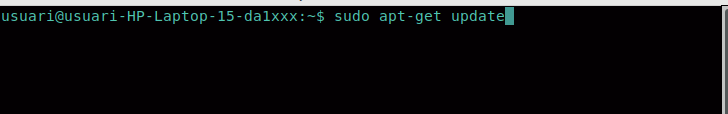
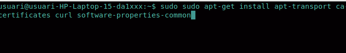
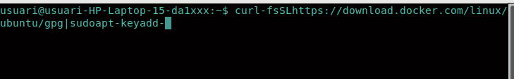
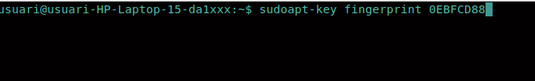
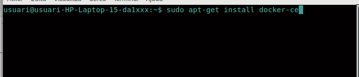
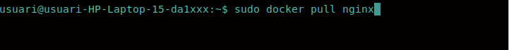
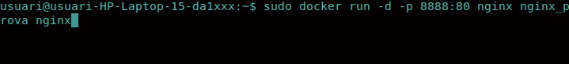
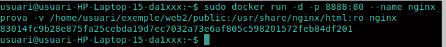
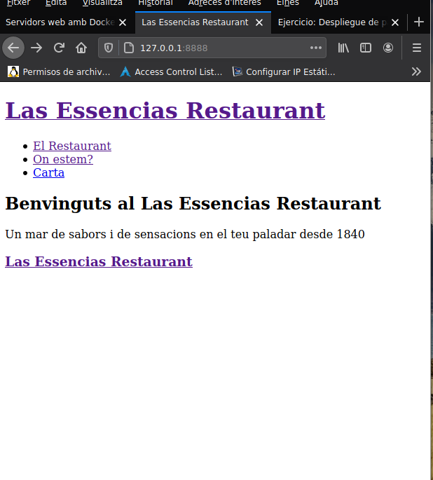

# Servidor web amb Docker

## Memòria

### Instal.lació

En primer lloc instal.larem actualitzarem la caché de paquetets del nostre equip mitjançant l'ordre següent:

Una vegada actualitzat, instal.larem els següents paquets:

A continució una vegada ja hem instal.lat els paquets,descarregarem la clau GPG per tal que el nostre sistema confíe un lloc per a la descàrrega del programari.

Després comprovarem la clau que estiga correctament instal.lada a través d'aquest comandament:

Si tot està correcte,afegirem als orígens de programari del nostre sistema a través del ordre "sudo add-apt-repository més el nom del repository" que l'afegirà al sources.list

Una vegada realitzat aquests passos, inst.larem docker mitjançant:

Una vegada instl.lat,crearem un contenidor a partir d'una imatge del servidor web nginx.Per tant,en primer lloc descargarem l'imatge oficial d'Nginx amb aquesta ordre:

Després el llançarem al domini 8888 i en el por 80 mitjançant lòrdre següent:

Amb aquesta ordre tenim el servidor web nginx i ens mostrarà en el navegador la pàgina web d'nginx de benvinguda. Per tant,localitzarem la nostra carpeta pública generada amb hugo aln ostre lloc wen i oferim a la imatge d'ngix per a que ens cree el contenidor.

Com podem observar en la imatge, -v es on especificare m el volum que serà la carpeta que li hem indicat a la nostra màquina.

Amb açò tindrem disponible la adreça 127.0.0.1:8888 al servidor web funcionant en Docker amb la nostra web.

